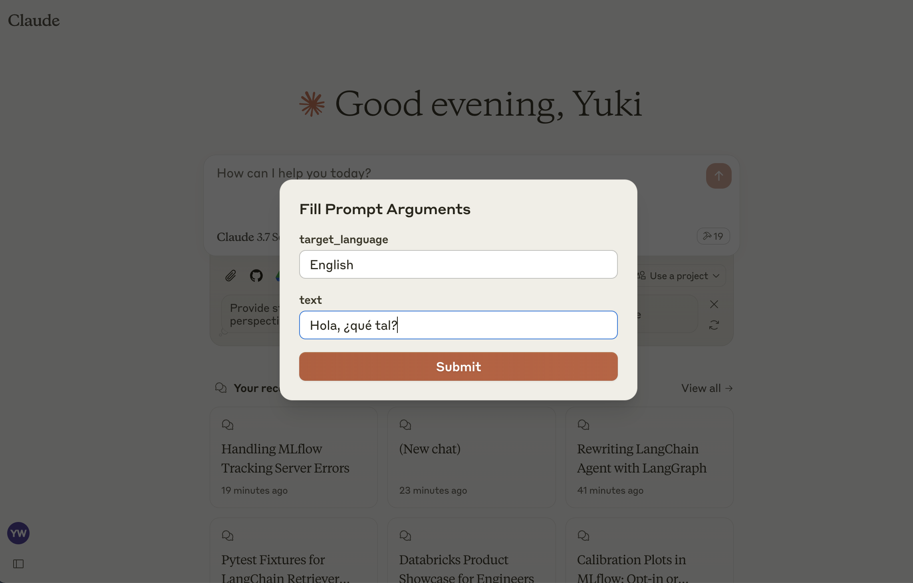

# MLflow Prompt Registry MCP Server

Model Context Protocol (MCP) Server for [MLflow Prompt Registry](https://mlflow.org/docs/latest/prompts), enabling access to prompt templates managed in MLflow.

This server implements the [MCP Prompts specification](https://github.com/anthropics/ModelContextProtocol/blob/main/docs/prompts.md) for discovering and using prompt templates from MLflow Prompt Registry. The primary use case is to load prompt templates from MLflow in Claude Desktop, allowing users to instruct Claude conveniently for repetitive tasks or common workflows.



## Tools

- `list-prompts`
  - List available prompts
  - Inputs:
    - `cursor` (optional string): Cursor for pagination
    - `filter` (optional string): Filter for prompts
  - Returns: List of prompt objects
- `get-prompt`
  - Retrieve and compile a specific prompt
  - Inputs:
    - `name` (string): Name of the prompt to retrieve
    - `arguments` (optional object): JSON object with prompt variables
  - Returns: Compiled prompt object


## Setup

### 1: Install MLflow and Start Prompt Registry

Install and start an MLflow server if you haven't already to host the Prompt Registry:

```bash
pip install mlflow>=2.21.1
mlflow server --port 5000
```

### 2: Create a prompt template in MLflow

If you haven't already, create a prompt template in MLflow following [this guide](https://mlflow.org/docs/latest/prompts#1-create-a-prompt).

### 3: Build MCP Server

```bash
npm install
npm run build
```

### 4: Add the server to Claude Desktop

Configure Claude for Desktop by editing `claude_desktop_config.json`:

```json
{
  "mcpServers": {
    "mlflow": {
      "command": "node",
      "args": ["<absolute-path-to-this-repository>/dist/index.js"],
      "env": {
        "MLFLOW_TRACKING_URI": "http://localhost:5000"
      }
    }
  }
}
```

Make sure to replace the `MLFLOW_TRACKING_URI` with your actual MLflow server address.
